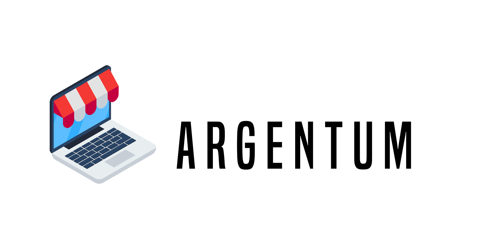

<!--

-->

<div align= "center">
    <a href= "#">
        
    </a>
</div>

# Argentum

    "Si existe, lo tenemos."

--- 

## Descripcion.

*Es una empresa de Argentina, de comercio electronico, fundada en el año 2010, en la ciudad de Rosario, provincia de Santa Fe.*

*Esta empresa, esta dedicada a la venta de productos electronicos.*

*Te brindamos:*

- gran variedad de productos
- gran variedad de marcas
    - nacionales
    - extranjeras
- precios razonables 
- seguridad web
- garantia 5 años

--- 

## Sucursales.

**Provincia, Buenos Aires:** CABA[^1]

**Provincia, Santa Fe:** Rosario[^2]

**Envios sin cargo:**

- CABA & Rosario
- Resto del pais
    - Compras superiores de $10 mil (Pesos Argentinos)

<!-- 
```diff
+ CABA & Rosario
- Resto del pais
    - Compras superiores de $10 mil (Pesos Argentinos)
```
-->

--- 

## Fundadores.

| Apellido + Nombres        | Edad  | Ciudad           |
|---------------------------|-------|------------------|
| [Novoa, Julieta](https://github.com/julietanovoa "@julietanovoa")            | 29    | Buenos Aires     |
| [Mazzinghi, Michele](http://github.com/Mikimazz "@Mikimazz")                 | 30    | Buenos Aires     |
| [Quartero, Nicolas](https://github.com/nicoquartero "@nicoquartero")         | 29    | Rosario          |
| [Yanzon, Pablo](https://github.com/yanzonpablo "@yanzonpablo")               | 42    | Rosario          |
| [Lema, Enrique Alfonso](https://github.com/EnriqueAlfonso "@EnriqueAlfonso") | 39    | Buenos Aires     |

--- 

## Comentarios.

> *"Argentum es muy fiable sobre todo en atención al cliente, y respuesta rápida. Da gusto!! Yo personalmente compro cosas de todo tipo. Ya es por costumbre. Lo que si es cierto es que jamás te dejan tirado y siempre te ayudan, ante cualquier problema. Cualquier cosa que compro, lo recibo en mi casa, al dia siguiente. Viva Argentum!! :heart: :heart: :heart:"* - **Luciana Arochena** 

> *"He hecho muchas compras en esta tienda, y aunque he tenido problemas alguna que otra vez, siempre me han resulto el problema rápida y eficazmente, lo recomiendo al 100%. Como anécdota, en un una ocasión, tuve un problema con un equipo de sonido tras 18 meses, y al no tener fácil arreglo, me devolvieron el dinero, todo el dinero. ¿Quien hace esto ademas de Argentum?"* - **Victor Ramos**

> *"En Argentum, llevo desde 2018 como cliente, en ese año hice 7 pedidos, en 2021 hice 219 pedidos, y la verdad es que estoy muy satisfecho. Muy pocas veces he tenido que devolver algo por mala calidad, y siempre me han atendido rápidamente. Te atienden rápido, te devuelven el dinero, y cada vez encuentras más productos, a mejor precio, y con entregas de un día para otro. Si pides factura te la dan, en fin, sin problemas."* - **Sergio Pamplona**

---

## Sitios Web de referencia.

**Por productos/servicios.**

https://www.fravega.com/

https://www.garbarino.com/

https://www.musimundo.com/

**Por diseño.**

https://comunidadcoderhouse.com/

https://www.austral3d.com.ar/

**Por robustez en el mercado.**

https://www.amazon.com/

https://www.mercadolibre.com/

--- 


**Enlace al tablero de trabajo:** https://trello.com/b/kgWiDBjj/sprint-2
**Enlace al tablero de trabajo:** https://trello.com/b/YPEiss5z/sprint-3
**Enlace al tablero de trabajo:** https://trello.com/b/3YnretGI/sprint-4
**Enlace al tablero de trabajo:** https://trello.com/b/y5f0C1yJ/sprint-5
**Enlace al tablero de trabajo:** https://trello.com/b/y5f0C1yJ/sprint-5-6